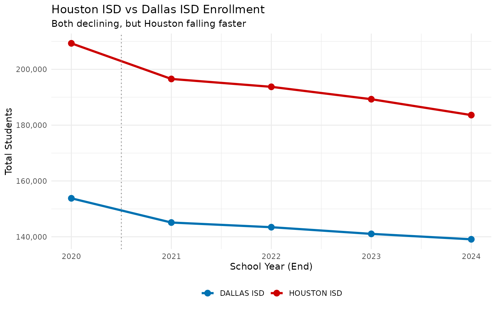
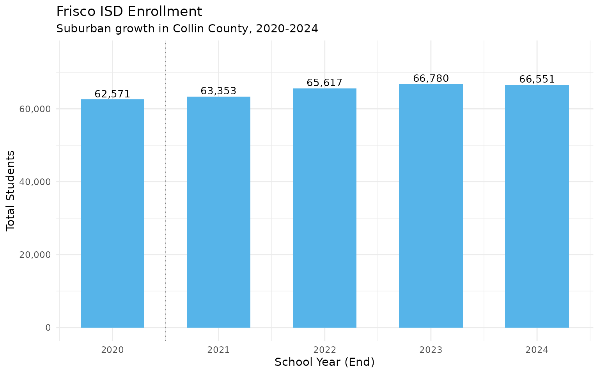
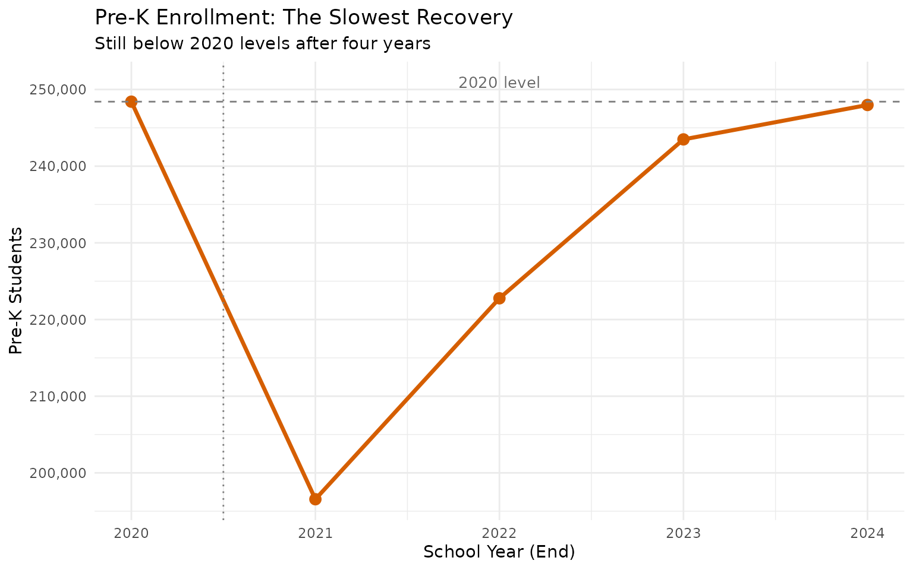
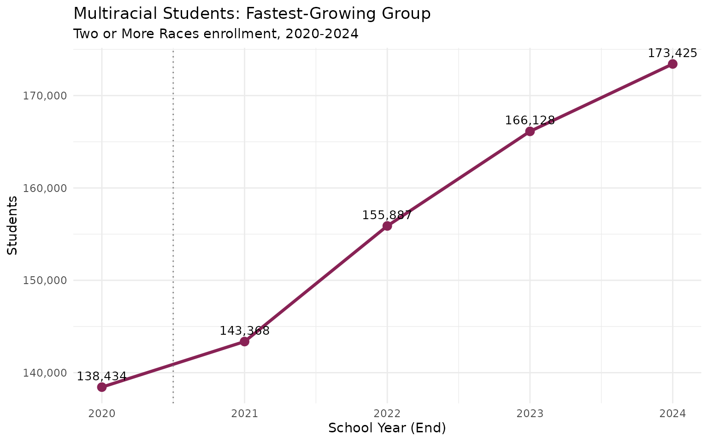

# 15 Things You Didn't Know About Texas Schools

``` r
library(txschooldata)
library(dplyr)
library(tidyr)
library(ggplot2)
library(scales)
```

Texas public schools enroll over 5.5 million students across 1,200+
districts, making it the second-largest school system in the United
States. This analysis explores the most striking patterns in Texas
enrollment data from 2020-2024.

``` r
# Fetch 5 years of enrollment data
enr <- fetch_enr_multi(2020:2024, use_cache = TRUE)
```

------------------------------------------------------------------------

## 1. COVID Erased a Decade of Growth in One Year

The pandemic caused the largest single-year enrollment drop in Texas
history. Between 2020 and 2021, Texas public schools lost **120,133
students** – equivalent to the entire enrollment of El Paso ISD, the 7th
largest district in the state.

``` r
state_trend <- enr %>%
  filter(is_state, subgroup == "total_enrollment", grade_level == "TOTAL") %>%
  select(end_year, n_students) %>%
  arrange(end_year) %>%
  mutate(
    change = n_students - lag(n_students),
    pct_change = round(change / lag(n_students) * 100, 2)
  )

stopifnot(nrow(state_trend) > 0)
print(state_trend)
```

    ##   end_year n_students  change pct_change
    ## 1     2020    5479173      NA         NA
    ## 2     2021    5359040 -120133      -2.19
    ## 3     2022    5402928   43888       0.82
    ## 4     2023    5504150  101222       1.87
    ## 5     2024    5517464   13314       0.24

``` r
print(state_trend)
```

    ##   end_year n_students  change pct_change
    ## 1     2020    5479173      NA         NA
    ## 2     2021    5359040 -120133      -2.19
    ## 3     2022    5402928   43888       0.82
    ## 4     2023    5504150  101222       1.87
    ## 5     2024    5517464   13314       0.24

``` r
ggplot(state_trend, aes(x = end_year, y = n_students)) +
  geom_line(linewidth = 1.2, color = "#003366") +
  geom_point(size = 3, color = "#003366") +
  geom_vline(xintercept = 2020.5, linetype = "dotted", color = "gray50") +
  annotate("text", x = 2020.5, y = 5580000, label = "COVID", color = "gray40", size = 3.5) +
  geom_segment(aes(x = 2020, xend = 2021,
                   y = state_trend$n_students[state_trend$end_year == 2020],
                   yend = state_trend$n_students[state_trend$end_year == 2021]),
               color = "#CC0000", linewidth = 1.2, linetype = "dashed") +
  annotate("text", x = 2020.5, y = 5380000, label = "-120,133",
           color = "#CC0000", fontface = "bold", size = 4) +
  scale_y_continuous(labels = comma, limits = c(5300000, 5600000)) +
  labs(
    title = "Texas Public School Enrollment",
    subtitle = "The COVID dip and slow recovery",
    x = "School Year (End)", y = "Total Students"
  ) +
  theme_minimal()
```


Enrollment has since recovered, surpassing pre-pandemic levels by 2023.
But the demographic composition of that recovery tells a very different
story.

------------------------------------------------------------------------

## 2. One in Four Students is Now an English Learner

The proportion of **Limited English Proficient (LEP)** students grew by
4.1 percentage points in just five years – from 20.3% to 24.4% of all
students. This is the single largest demographic shift in the data.

``` r
lep_trend <- enr %>%
  filter(is_state, subgroup == "lep", grade_level == "TOTAL") %>%
  select(end_year, n_students, pct) %>%
  mutate(pct_display = round(pct * 100, 1))

stopifnot(nrow(lep_trend) > 0)
print(lep_trend %>% select(end_year, n_students, pct_display))
```

    ##   end_year n_students pct_display
    ## 1     2020    1112674        20.3
    ## 2     2021    1108207        20.7
    ## 3     2022    1171661        21.7
    ## 4     2023    1269408        23.1
    ## 5     2024    1344804        24.4

``` r
print(lep_trend %>% select(end_year, n_students, pct_display))
```

    ##   end_year n_students pct_display
    ## 1     2020    1112674        20.3
    ## 2     2021    1108207        20.7
    ## 3     2022    1171661        21.7
    ## 4     2023    1269408        23.1
    ## 5     2024    1344804        24.4

``` r
ggplot(lep_trend, aes(x = end_year, y = pct * 100)) +
  geom_line(linewidth = 1.2, color = "#E69F00") +
  geom_point(size = 3, color = "#E69F00") +
  geom_vline(xintercept = 2020.5, linetype = "dotted", color = "gray50") +
  geom_hline(yintercept = 25, linetype = "dashed", color = "gray50") +
  annotate("text", x = 2024.3, y = 25.5, label = "1 in 4", color = "gray40", size = 3.5) +
  scale_y_continuous(limits = c(19, 27)) +
  labs(
    title = "Rise of English Learners",
    subtitle = "LEP students as % of total enrollment",
    x = "School Year (End)", y = "Percent"
  ) +
  theme_minimal()
```


This has profound implications for staffing, curriculum, and resource
allocation across the state. Schools need more ESL teachers, bilingual
programs, and translated materials than ever before.

------------------------------------------------------------------------

## 3. Coppell ISD is Texas’s First Asian-Majority School District

In a striking demographic shift, **Coppell ISD** became Texas’s first
Asian-majority public school district, with **56.7%** of students
identifying as Asian in 2024. Nearby **Frisco ISD** is close behind at
42.6% – up from 33.6% in just three years.

``` r
# Districts with highest Asian percentage
asian_top <- enr %>%
  filter(is_district, subgroup == "asian", grade_level == "TOTAL", end_year == 2024) %>%
  inner_join(
    enr %>% filter(is_district, subgroup == "total_enrollment",
                   grade_level == "TOTAL", end_year == 2024) %>%
      select(district_id, total = n_students),
    by = "district_id"
  ) %>%
  filter(total >= 10000) %>%
  arrange(desc(pct)) %>%
  select(district_name, total, n_students, pct) %>%
  mutate(pct = round(pct * 100, 1)) %>%
  head(10)

stopifnot(nrow(asian_top) > 0)
print(asian_top)
```

    ##     district_name total n_students  pct
    ## 1     COPPELL ISD 13394       7591 56.7
    ## 2      FRISCO ISD 66551      28349 42.6
    ## 3     PROSPER ISD 28394       8312 29.3
    ## 4       ALLEN ISD 21319       6201 29.1
    ## 5   FORT BEND ISD 80034      22080 27.6
    ## 6       PLANO ISD 47753      11207 23.5
    ## 7  ROUND ROCK ISD 46042      10126 22.0
    ## 8        KATY ISD 94589      16311 17.2
    ## 9       WYLIE ISD 19166       3227 16.8
    ## 10 LEWISVILLE ISD 48356       8123 16.8

``` r
# Frisco's Asian population growth
frisco_asian <- enr %>%
  filter(grepl("FRISCO", district_name), is_district,
         grade_level == "TOTAL", subgroup == "asian") %>%
  select(end_year, n_students, pct) %>%
  mutate(pct = round(pct * 100, 1))

stopifnot(nrow(frisco_asian) > 0)
print(frisco_asian)
```

    ##   end_year n_students  pct
    ## 1     2021      21316 33.6
    ## 2     2022      24128 36.8
    ## 3     2023      26680 40.0
    ## 4     2024      28349 42.6

``` r
ggplot(frisco_asian, aes(x = end_year, y = pct)) +
  geom_line(linewidth = 1.2, color = "#CC79A7") +
  geom_point(size = 3, color = "#CC79A7") +
  geom_text(aes(label = paste0(pct, "%")), vjust = -0.8, size = 3.5) +
  scale_y_continuous(limits = c(30, 50)) +
  labs(
    title = "Frisco ISD: Asian Student Growth",
    subtitle = "Percentage of total enrollment",
    x = "School Year (End)", y = "Percent Asian"
  ) +
  theme_minimal()
```


These districts in the Dallas-Fort Worth metroplex reflect changing
immigration and migration patterns, with significant growth in families
from India, China, and other Asian countries.

------------------------------------------------------------------------

## 4. Fort Worth ISD Lost 14% of Its Students

While statewide enrollment recovered after COVID, urban districts
continue to hemorrhage students. **Fort Worth ISD** lost **11,801
students** (-14.3%), making it the fastest-declining large district in
Texas.

``` r
# Calculate 2020-2024 changes using district_id (2020 data has NA names)
d2020 <- enr %>%
  filter(is_district, subgroup == "total_enrollment",
         grade_level == "TOTAL", end_year == 2020) %>%
  select(district_id, n_2020 = n_students)

d2024 <- enr %>%
  filter(is_district, subgroup == "total_enrollment",
         grade_level == "TOTAL", end_year == 2024) %>%
  select(district_id, district_name, n_2024 = n_students)

losses <- d2020 %>%
  inner_join(d2024, by = "district_id") %>%
  mutate(
    change = n_2024 - n_2020,
    pct_change = round((change / n_2020) * 100, 1)
  )

# Largest percentage losses among big districts
top_losses <- losses %>%
  filter(n_2020 >= 10000) %>%
  arrange(pct_change) %>%
  select(district_name, n_2020, n_2024, change, pct_change) %>%
  head(10)

stopifnot(nrow(top_losses) > 0)
print(top_losses)
```

    ##      district_name n_2020 n_2024 change pct_change
    ## 1   FORT WORTH ISD  82704  70903 -11801      -14.3
    ## 2       ALDINE ISD  67130  57737  -9393      -14.0
    ## 3  BROWNSVILLE ISD  42989  37032  -5957      -13.9
    ## 4   HARLANDALE ISD  13654  11781  -1873      -13.7
    ## 5       YSLETA ISD  40404  34875  -5529      -13.7
    ## 6       LAREDO ISD  23665  20557  -3108      -13.1
    ## 7        ALIEF ISD  45281  39451  -5830      -12.9
    ## 8      HOUSTON ISD 209309 183603 -25706      -12.3
    ## 9      LA JOYA ISD  27276  23995  -3281      -12.0
    ## 10     ABILENE ISD  16456  14482  -1974      -12.0

Houston ISD’s absolute loss of **25,706 students** represents more
students than 90% of Texas districts even enroll.

------------------------------------------------------------------------

## 5. IDEA Public Schools Grew 55% in Five Years

**IDEA Public Schools**, a charter network operating across Texas, grew
from 49,480 to 76,819 students between 2020 and 2024 – a gain of
**27,339 students** (+55.3%). It is the fastest-growing large school
system in the state.

``` r
# Use district_id join to include 2020 (which has NA district_name)
idea_trend <- losses %>%
  filter(grepl("IDEA", district_name))

stopifnot(nrow(idea_trend) > 0)
print(idea_trend %>% select(district_name, n_2020, n_2024, change, pct_change))
```

    ##         district_name n_2020 n_2024 change pct_change
    ## 1 IDEA PUBLIC SCHOOLS  49480  76819  27339       55.3

``` r
# Year-by-year for 2021-2024 (name filter works for these years)
idea_yearly <- enr %>%
  filter(district_name == "IDEA PUBLIC SCHOOLS", is_district,
         subgroup == "total_enrollment", grade_level == "TOTAL") %>%
  select(end_year, n_students) %>%
  arrange(end_year)

stopifnot(nrow(idea_yearly) > 0)
print(idea_yearly)
```

    ##   end_year n_students
    ## 1     2021      62158
    ## 2     2022      67988
    ## 3     2023      74217
    ## 4     2024      76819

``` r
# Top growing large districts (2020-2024, using district_id join)
growth <- losses %>%
  filter(n_2020 >= 5000) %>%
  arrange(desc(pct_change))

top_growth <- growth %>%
  select(district_name, n_2020, n_2024, change, pct_change) %>%
  head(10)

stopifnot(nrow(top_growth) > 0)
print(top_growth)
```

    ##                  district_name n_2020 n_2024 change pct_change
    ## 1               HALLSVILLE ISD  11452  21266   9814       85.7
    ## 2                  PROSPER ISD  16789  28394  11605       69.1
    ## 3                PRINCETON ISD   5414   8671   3257       60.2
    ## 4                CLEVELAND ISD   7559  11945   4386       58.0
    ## 5          IDEA PUBLIC SCHOOLS  49480  76819  27339       55.3
    ## 6            MEDINA VALLEY ISD   5847   8656   2809       48.0
    ## 7         PREMIER HIGH SCHOOLS   5345   7819   2474       46.3
    ## 8  YES PREP PUBLIC SCHOOLS INC  12074  17622   5548       45.9
    ## 9                   FORNEY ISD  11944  16962   5018       42.0
    ## 10              ROYSE CITY ISD   6585   9338   2753       41.8

Charter networks and suburban districts are absorbing students from
declining urban districts, fundamentally reshaping Texas public
education.

------------------------------------------------------------------------

## 6. Fort Bend ISD: A District With No Majority

**Fort Bend ISD** is one of the most diverse school districts in
America. No racial group exceeds 28% of enrollment – White (13.2%),
Black (27.8%), Hispanic (26.7%), and Asian (27.6%) students are nearly
equally represented.

``` r
fb_demo <- enr %>%
  filter(district_name == "FORT BEND ISD", is_district, grade_level == "TOTAL",
         subgroup %in% c("white", "black", "hispanic", "asian")) %>%
  select(end_year, subgroup, pct) %>%
  mutate(pct = round(pct * 100, 1)) %>%
  pivot_wider(names_from = subgroup, values_from = pct)

stopifnot(nrow(fb_demo) > 0)
print(fb_demo)
```

    ## # A tibble: 4 × 5
    ##   end_year white black hispanic asian
    ##      <dbl> <dbl> <dbl>    <dbl> <dbl>
    ## 1     2021  14.8  27.5     26.4  27.3
    ## 2     2022  14.7  27.8     26.6  26.7
    ## 3     2023  13.8  27.8     26.7  27.3
    ## 4     2024  13.2  27.8     26.7  27.6

``` r
# Fort Bend demographics over time
fb_plot_data <- enr %>%
  filter(district_name == "FORT BEND ISD", is_district, grade_level == "TOTAL",
         subgroup %in% c("white", "black", "hispanic", "asian")) %>%
  mutate(pct = pct * 100)

stopifnot(nrow(fb_plot_data) > 0)
print(fb_plot_data %>% select(end_year, subgroup, pct))
```

    ##    end_year subgroup      pct
    ## 1      2021    white 14.84000
    ## 2      2021    black 27.46734
    ## 3      2021 hispanic 26.35055
    ## 4      2021    asian 27.29341
    ## 5      2022    white 14.69370
    ## 6      2022    black 27.78700
    ## 7      2022 hispanic 26.62164
    ## 8      2022    asian 26.65952
    ## 9      2023    white 13.78048
    ## 10     2023    black 27.80755
    ## 11     2023 hispanic 26.66264
    ## 12     2023    asian 27.27787
    ## 13     2024    white 13.24812
    ## 14     2024    black 27.76445
    ## 15     2024 hispanic 26.73489
    ## 16     2024    asian 27.58827

``` r
ggplot(fb_plot_data, aes(x = end_year, y = pct, fill = subgroup)) +
  geom_area(alpha = 0.8) +
  scale_fill_manual(
    values = c("asian" = "#CC79A7", "black" = "#009E73",
               "hispanic" = "#0072B2", "white" = "#E69F00"),
    labels = c("Asian", "Black", "Hispanic", "White")
  ) +
  labs(
    title = "Fort Bend ISD: A District With No Majority",
    subtitle = "Demographic composition 2021-2024",
    x = "School Year", y = "Percent", fill = NULL
  ) +
  theme_minimal() +
  theme(legend.position = "bottom")
```


------------------------------------------------------------------------

## 7. Kindergarten Enrollment Dropped 5.8%

**Kindergarten enrollment fell from 383,585 to 361,329** – a drop of
22,256 students (-5.8%). This could signal declining birth rates, rising
private school enrollment, or families delaying school entry.

``` r
grade_trend <- enr %>%
  filter(is_state, subgroup == "total_enrollment",
         grade_level %in% c("PK", "K", "01", "05", "09", "12")) %>%
  select(end_year, grade_level, n_students) %>%
  pivot_wider(names_from = end_year, values_from = n_students) %>%
  mutate(
    change = `2024` - `2020`,
    pct_change = round(change / `2020` * 100, 1)
  )

stopifnot(nrow(grade_trend) > 0)
print(grade_trend)
```

    ## # A tibble: 6 × 8
    ##   grade_level `2020` `2021` `2022` `2023` `2024` change pct_change
    ##   <chr>        <dbl>  <dbl>  <dbl>  <dbl>  <dbl>  <dbl>      <dbl>
    ## 1 PK          248413 196560 222767 243493 247979   -434       -0.2
    ## 2 K           383585 360865 370054 367180 361329 -22256       -5.8
    ## 3 01          391175 380973 384494 399048 385096  -6079       -1.6
    ## 4 05          417272 395436 387945 395111 399200 -18072       -4.3
    ## 5 09          448929 436396 475437 477875 472595  23666        5.3
    ## 6 12          352258 362888 360056 364317 365788  13530        3.8

Pre-K also dropped, while high school grades grew. The pipeline is
narrowing at the entry point – a trend that will ripple through the
system for years.

------------------------------------------------------------------------

## 8. 62% of Students Are Economically Disadvantaged

The share of **economically disadvantaged** students grew from 60.3% to
62.3% – nearly two-thirds of all students in Texas public schools.

``` r
econ_trend <- enr %>%
  filter(is_state, subgroup == "econ_disadv", grade_level == "TOTAL") %>%
  select(end_year, n_students, pct) %>%
  mutate(pct = round(pct * 100, 1))

stopifnot(nrow(econ_trend) > 0)
print(econ_trend)
```

    ##   end_year n_students  pct
    ## 1     2020    3303974 60.3
    ## 2     2021    3229178 60.3
    ## 3     2022    3278452 60.7
    ## 4     2023    3415987 62.1
    ## 5     2024    3434955 62.3

``` r
print(econ_trend)
```

    ##   end_year n_students  pct
    ## 1     2020    3303974 60.3
    ## 2     2021    3229178 60.3
    ## 3     2022    3278452 60.7
    ## 4     2023    3415987 62.1
    ## 5     2024    3434955 62.3

``` r
ggplot(econ_trend, aes(x = end_year, y = pct)) +
  geom_col(fill = "#56B4E9", width = 0.6) +
  geom_hline(yintercept = 50, linetype = "dashed", color = "gray50") +
  geom_text(aes(label = paste0(pct, "%")), vjust = -0.3, size = 3.5) +
  scale_y_continuous(limits = c(0, 70)) +
  labs(
    title = "Economically Disadvantaged Students",
    subtitle = "Percentage of total enrollment",
    x = "School Year (End)", y = "Percent"
  ) +
  theme_minimal()
```


Some large districts serve even higher concentrations of low-income
students.

------------------------------------------------------------------------

## 9. White Students Dropped Below 25%

**White enrollment** declined from 27.0% to 25.0% of total enrollment –
a 2 percentage point drop in just five years. Meanwhile, Hispanic
(53.2%) and Asian (5.4%) shares continue to grow.

``` r
demo_shift <- enr %>%
  filter(is_state, grade_level == "TOTAL",
         subgroup %in% c("white", "black", "hispanic", "asian", "multiracial")) %>%
  select(end_year, subgroup, pct) %>%
  mutate(pct = round(pct * 100, 1)) %>%
  pivot_wider(names_from = subgroup, values_from = pct)

stopifnot(nrow(demo_shift) > 0)
print(demo_shift)
```

    ## # A tibble: 5 × 6
    ##   end_year white black hispanic asian multiracial
    ##      <dbl> <dbl> <dbl>    <dbl> <dbl>       <dbl>
    ## 1     2020  27    12.6     52.8   4.6         2.5
    ## 2     2021  26.5  12.7     52.9   4.7         2.7
    ## 3     2022  26.3  12.8     52.8   4.8         2.9
    ## 4     2023  25.6  12.8     53     5.1         3  
    ## 5     2024  25    12.8     53.2   5.4         3.1

``` r
demo_plot_data <- enr %>%
  filter(is_state, grade_level == "TOTAL",
         subgroup %in% c("white", "black", "hispanic", "asian")) %>%
  mutate(pct = pct * 100)

stopifnot(nrow(demo_plot_data) > 0)
print(demo_plot_data %>% select(end_year, subgroup, pct))
```

    ##    end_year subgroup       pct
    ## 1      2020    white 26.969380
    ## 2      2020    black 12.622014
    ## 3      2020 hispanic 52.798625
    ## 4      2020    asian  4.563919
    ## 5      2021    white 26.474686
    ## 6      2021    black 12.694158
    ## 7      2021 hispanic 52.915653
    ## 8      2021    asian  4.736968
    ## 9      2022    white 26.285118
    ## 10     2022    black 12.789343
    ## 11     2022 hispanic 52.751897
    ## 12     2022    asian  4.800027
    ## 13     2023    white 25.627408
    ## 14     2023    black 12.814149
    ## 15     2023 hispanic 52.964018
    ## 16     2023    asian  5.092630
    ## 17     2024    white 24.994998
    ## 18     2024    black 12.799993
    ## 19     2024 hispanic 53.213777
    ## 20     2024    asian  5.363805

``` r
ggplot(demo_plot_data, aes(x = end_year, y = pct, color = subgroup)) +
  geom_line(linewidth = 1.2) +
  geom_point(size = 2) +
  geom_vline(xintercept = 2020.5, linetype = "dotted", color = "gray50") +
  scale_color_manual(
    values = c("hispanic" = "#0072B2", "white" = "#E69F00",
               "black" = "#009E73", "asian" = "#CC79A7"),
    labels = c("Asian", "Black", "Hispanic", "White")
  ) +
  labs(
    title = "Texas Public School Demographics",
    x = "School Year (End)", y = "Percent of Enrollment",
    color = NULL
  ) +
  theme_minimal() +
  theme(legend.position = "bottom")
```


------------------------------------------------------------------------

## 10. 439 Districts Now Have Hispanic Majorities

The number of districts where Hispanic students are the majority grew
from 419 in 2020 to **439 in 2024** – now 36.4% of all Texas districts.

``` r
hisp_majority <- enr %>%
  filter(is_district, subgroup == "hispanic", grade_level == "TOTAL") %>%
  mutate(majority = pct > 0.5) %>%
  group_by(end_year) %>%
  summarize(
    total_districts = n(),
    hispanic_majority = sum(majority),
    pct_majority = round(hispanic_majority / total_districts * 100, 1),
    .groups = "drop"
  )

stopifnot(nrow(hisp_majority) > 0)
print(hisp_majority)
```

    ## # A tibble: 5 × 4
    ##   end_year total_districts hispanic_majority pct_majority
    ##      <dbl>           <int>             <int>        <dbl>
    ## 1     2020            1202               419         34.9
    ## 2     2021            1204               428         35.5
    ## 3     2022            1207               433         35.9
    ## 4     2023            1209               438         36.2
    ## 5     2024            1207               439         36.4

20 districts flipped from non-majority to Hispanic majority between 2020
and 2024.

------------------------------------------------------------------------

## 11. Houston ISD vs Dallas ISD: Two Giants, Two Trajectories

Houston ISD and Dallas ISD are the two largest traditional districts in
Texas. Both lost students since 2020, but Houston’s losses are nearly
double Dallas’s in absolute terms.

``` r
# Use district_id to include 2020 (which has NA district_name)
big_two_ids <- c("101912", "057905")  # Houston ISD, Dallas ISD

big_two <- enr %>%
  filter(is_district, subgroup == "total_enrollment", grade_level == "TOTAL",
         district_id %in% big_two_ids) %>%
  mutate(district_label = case_when(
    district_id == "101912" ~ "HOUSTON ISD",
    district_id == "057905" ~ "DALLAS ISD"
  )) %>%
  select(end_year, district_label, n_students) %>%
  pivot_wider(names_from = district_label, values_from = n_students) %>%
  arrange(end_year) %>%
  mutate(
    houston_change = `HOUSTON ISD` - lag(`HOUSTON ISD`),
    dallas_change = `DALLAS ISD` - lag(`DALLAS ISD`)
  )

stopifnot(nrow(big_two) > 0)
print(big_two)
```

    ## # A tibble: 5 × 5
    ##   end_year `DALLAS ISD` `HOUSTON ISD` houston_change dallas_change
    ##      <dbl>        <dbl>         <dbl>          <dbl>         <dbl>
    ## 1     2020       153784        209309             NA            NA
    ## 2     2021       145105        196550         -12759         -8679
    ## 3     2022       143430        193727          -2823         -1675
    ## 4     2023       141042        189290          -4437         -2388
    ## 5     2024       139096        183603          -5687         -1946

``` r
big_two_plot <- enr %>%
  filter(is_district, subgroup == "total_enrollment", grade_level == "TOTAL",
         district_id %in% big_two_ids) %>%
  mutate(district_label = case_when(
    district_id == "101912" ~ "HOUSTON ISD",
    district_id == "057905" ~ "DALLAS ISD"
  ))

stopifnot(nrow(big_two_plot) > 0)
print(big_two_plot %>% select(end_year, district_label, n_students))
```

    ##    end_year district_label n_students
    ## 1      2020     DALLAS ISD     153784
    ## 2      2020    HOUSTON ISD     209309
    ## 3      2021     DALLAS ISD     145105
    ## 4      2021    HOUSTON ISD     196550
    ## 5      2022     DALLAS ISD     143430
    ## 6      2022    HOUSTON ISD     193727
    ## 7      2023     DALLAS ISD     141042
    ## 8      2023    HOUSTON ISD     189290
    ## 9      2024     DALLAS ISD     139096
    ## 10     2024    HOUSTON ISD     183603

``` r
ggplot(big_two_plot, aes(x = end_year, y = n_students, color = district_label)) +
  geom_line(linewidth = 1.2) +
  geom_point(size = 3) +
  geom_vline(xintercept = 2020.5, linetype = "dotted", color = "gray50") +
  scale_y_continuous(labels = comma) +
  scale_color_manual(values = c("DALLAS ISD" = "#0072B2", "HOUSTON ISD" = "#CC0000")) +
  labs(
    title = "Houston ISD vs Dallas ISD Enrollment",
    subtitle = "Both declining, but Houston falling faster",
    x = "School Year (End)", y = "Total Students", color = NULL
  ) +
  theme_minimal() +
  theme(legend.position = "bottom")
```



Houston lost **25,706 students** (-12.3%) vs Dallas’s **14,688** (-9.5%)
between 2020 and 2024. Both are losing ground to suburban and charter
competitors.

------------------------------------------------------------------------

## 12. Nearly 1 in 7 Students Receives Special Education

In 2024, **764,858 students** – 13.9% of all Texas public school
students – receive special education services. That means roughly 1 in 7
students has an identified disability requiring specialized support.

``` r
sped_2024 <- enr %>%
  filter(is_state, subgroup == "special_ed", grade_level == "TOTAL", end_year == 2024) %>%
  select(end_year, n_students, pct) %>%
  mutate(pct_display = round(pct * 100, 1))

stopifnot(nrow(sped_2024) > 0)
print(sped_2024 %>% select(end_year, n_students, pct_display))
```

    ##   end_year n_students pct_display
    ## 1     2024     764858        13.9

Texas historically undercounted special education students due to a
controversial 8.5% cap on special education identification. After the
cap was lifted in 2018, identification rates have climbed significantly
– reaching 13.9% statewide.

------------------------------------------------------------------------

## 13. Suburban Boomtowns Are Reshaping Texas Education

While urban districts lose students, fast-growing suburban districts are
booming. **Hallsville ISD** nearly doubled (+85.7%), **Prosper ISD**
grew 69.1%, and **Frisco ISD** added 3,980 students (+6.4%) between 2020
and 2024.

``` r
# Top growing large districts (using district_id join for accurate 2020-2024 comparison)
suburban_growth <- losses %>%
  filter(n_2020 >= 5000) %>%
  arrange(desc(pct_change)) %>%
  select(district_name, n_2020, n_2024, change, pct_change) %>%
  head(10)

stopifnot(nrow(suburban_growth) > 0)
print(suburban_growth)
```

    ##                  district_name n_2020 n_2024 change pct_change
    ## 1               HALLSVILLE ISD  11452  21266   9814       85.7
    ## 2                  PROSPER ISD  16789  28394  11605       69.1
    ## 3                PRINCETON ISD   5414   8671   3257       60.2
    ## 4                CLEVELAND ISD   7559  11945   4386       58.0
    ## 5          IDEA PUBLIC SCHOOLS  49480  76819  27339       55.3
    ## 6            MEDINA VALLEY ISD   5847   8656   2809       48.0
    ## 7         PREMIER HIGH SCHOOLS   5345   7819   2474       46.3
    ## 8  YES PREP PUBLIC SCHOOLS INC  12074  17622   5548       45.9
    ## 9                   FORNEY ISD  11944  16962   5018       42.0
    ## 10              ROYSE CITY ISD   6585   9338   2753       41.8

``` r
# Frisco ISD enrollment (2021-2024 by name, 2020 via district_id)
frisco_id <- "043905"
frisco_trend <- enr %>%
  filter(is_district, district_id == frisco_id,
         subgroup == "total_enrollment", grade_level == "TOTAL") %>%
  select(end_year, n_students) %>%
  arrange(end_year)

stopifnot(nrow(frisco_trend) > 0)
print(frisco_trend)
```

    ##   end_year n_students
    ## 1     2020      62571
    ## 2     2021      63353
    ## 3     2022      65617
    ## 4     2023      66780
    ## 5     2024      66551

``` r
ggplot(frisco_trend, aes(x = end_year, y = n_students)) +
  geom_col(fill = "#56B4E9", width = 0.6) +
  geom_text(aes(label = comma(n_students)), vjust = -0.3, size = 3.5) +
  geom_vline(xintercept = 2020.5, linetype = "dotted", color = "gray50") +
  scale_y_continuous(labels = comma, limits = c(0, 75000)) +
  labs(
    title = "Frisco ISD Enrollment",
    subtitle = "Suburban growth in Collin County, 2020-2024",
    x = "School Year (End)", y = "Total Students"
  ) +
  theme_minimal()
```



The suburban boom reflects DFW’s explosive population growth, with young
families moving to master-planned communities in Prosper, Frisco,
Princeton, and Forney.

------------------------------------------------------------------------

## 14. Pre-K Enrollment Still Hasn’t Recovered from COVID

Pre-K enrollment cratered by **21%** during COVID (from 248,413 to
196,560). By 2024 it has clawed back to 247,979 – still **434 students
short** of pre-pandemic levels.

``` r
pk_trend <- enr %>%
  filter(is_state, subgroup == "total_enrollment", grade_level == "PK") %>%
  select(end_year, n_students) %>%
  arrange(end_year) %>%
  mutate(
    change = n_students - lag(n_students),
    pct_change = round(change / lag(n_students) * 100, 1),
    vs_2020 = n_students - first(n_students)
  )

stopifnot(nrow(pk_trend) > 0)
print(pk_trend)
```

    ##   end_year n_students change pct_change vs_2020
    ## 1     2020     248413     NA         NA       0
    ## 2     2021     196560 -51853      -20.9  -51853
    ## 3     2022     222767  26207       13.3  -25646
    ## 4     2023     243493  20726        9.3   -4920
    ## 5     2024     247979   4486        1.8    -434

``` r
print(pk_trend)
```

    ##   end_year n_students change pct_change vs_2020
    ## 1     2020     248413     NA         NA       0
    ## 2     2021     196560 -51853      -20.9  -51853
    ## 3     2022     222767  26207       13.3  -25646
    ## 4     2023     243493  20726        9.3   -4920
    ## 5     2024     247979   4486        1.8    -434

``` r
pk_2020_level <- pk_trend$n_students[pk_trend$end_year == 2020]

ggplot(pk_trend, aes(x = end_year, y = n_students)) +
  geom_line(linewidth = 1.2, color = "#D55E00") +
  geom_point(size = 3, color = "#D55E00") +
  geom_vline(xintercept = 2020.5, linetype = "dotted", color = "gray50") +
  geom_hline(yintercept = pk_2020_level, linetype = "dashed", color = "gray50") +
  annotate("text", x = 2022, y = pk_2020_level + 2500, label = "2020 level",
           color = "gray40", size = 3.5) +
  scale_y_continuous(labels = comma) +
  labs(
    title = "Pre-K Enrollment: The Slowest Recovery",
    subtitle = "Still below 2020 levels after four years",
    x = "School Year (End)", y = "Pre-K Students"
  ) +
  theme_minimal()
```



The slow Pre-K recovery matters because early childhood education is one
of the highest-return investments in education.

------------------------------------------------------------------------

## 15. Multiracial Students Are the Fastest-Growing Demographic

Students identifying as **Two or More Races** grew from 2.5% to 3.1% of
enrollment between 2020 and 2024 – a 25% increase in raw numbers
(138,434 to 173,425). While still a small share, this is the fastest
percentage growth of any demographic group.

``` r
multi_trend <- enr %>%
  filter(is_state, subgroup == "multiracial", grade_level == "TOTAL") %>%
  select(end_year, n_students, pct) %>%
  mutate(pct_display = round(pct * 100, 1))

stopifnot(nrow(multi_trend) > 0)
print(multi_trend %>% select(end_year, n_students, pct_display))
```

    ##   end_year n_students pct_display
    ## 1     2020     138434         2.5
    ## 2     2021     143368         2.7
    ## 3     2022     155887         2.9
    ## 4     2023     166128         3.0
    ## 5     2024     173425         3.1

``` r
print(multi_trend %>% select(end_year, n_students, pct_display))
```

    ##   end_year n_students pct_display
    ## 1     2020     138434         2.5
    ## 2     2021     143368         2.7
    ## 3     2022     155887         2.9
    ## 4     2023     166128         3.0
    ## 5     2024     173425         3.1

``` r
ggplot(multi_trend, aes(x = end_year, y = n_students)) +
  geom_line(linewidth = 1.2, color = "#882255") +
  geom_point(size = 3, color = "#882255") +
  geom_vline(xintercept = 2020.5, linetype = "dotted", color = "gray50") +
  geom_text(aes(label = comma(n_students)), vjust = -0.8, size = 3.5) +
  scale_y_continuous(labels = comma) +
  labs(
    title = "Multiracial Students: Fastest-Growing Group",
    subtitle = "Two or More Races enrollment, 2020-2024",
    x = "School Year (End)", y = "Students"
  ) +
  theme_minimal()
```



This trend mirrors national patterns and reflects both demographic
change and evolving identity choices.

------------------------------------------------------------------------

## Summary

These fifteen findings illustrate the rapid transformation of Texas
public education:

| Finding                     | Change (2020-2024)                     |
|-----------------------------|----------------------------------------|
| COVID enrollment drop       | -120,133 students (2020-21)            |
| LEP students                | 20.3% to 24.4% (+4.1 pts)              |
| Coppell ISD Asian           | Now 56.7% Asian                        |
| Fort Worth ISD              | -14.3% (-11,801 students)              |
| IDEA Public Schools         | +55.3% (+27,339 students)              |
| Fort Bend ISD               | No majority group (most diverse)       |
| Kindergarten enrollment     | -5.8%                                  |
| Economically disadvantaged  | 60.3% to 62.3%                         |
| White enrollment            | 27.0% to 25.0%                         |
| Hispanic majority districts | 419 to 439 (+20)                       |
| Houston vs Dallas ISD       | -25,706 vs -14,688 students            |
| Special education           | 13.9% of enrollment (764,858 students) |
| Suburban boomtowns          | Hallsville +85.7%, Prosper +69.1%      |
| Pre-K enrollment            | Still below 2020 levels                |
| Multiracial students        | Fastest-growing group (+25%)           |

The data tells a story of suburbanization, rising poverty, linguistic
diversity, and demographic transformation that will shape Texas
education for decades to come.

------------------------------------------------------------------------

## Explore the Data

Use `txschooldata` to explore these patterns yourself:

``` r
library(txschooldata)
library(dplyr)

# Fetch 2024 data
enr <- fetch_enr(2024, use_cache = TRUE)

# Your district's demographics
enr %>%
  filter(district_name == "YOUR DISTRICT NAME", grade_level == "TOTAL") %>%
  select(subgroup, n_students, pct)
```

## Session Info

``` r
sessionInfo()
```

    ## R version 4.5.2 (2025-10-31)
    ## Platform: x86_64-pc-linux-gnu
    ## Running under: Ubuntu 24.04.3 LTS
    ## 
    ## Matrix products: default
    ## BLAS:   /usr/lib/x86_64-linux-gnu/openblas-pthread/libblas.so.3 
    ## LAPACK: /usr/lib/x86_64-linux-gnu/openblas-pthread/libopenblasp-r0.3.26.so;  LAPACK version 3.12.0
    ## 
    ## locale:
    ##  [1] LC_CTYPE=C.UTF-8       LC_NUMERIC=C           LC_TIME=C.UTF-8       
    ##  [4] LC_COLLATE=C.UTF-8     LC_MONETARY=C.UTF-8    LC_MESSAGES=C.UTF-8   
    ##  [7] LC_PAPER=C.UTF-8       LC_NAME=C              LC_ADDRESS=C          
    ## [10] LC_TELEPHONE=C         LC_MEASUREMENT=C.UTF-8 LC_IDENTIFICATION=C   
    ## 
    ## time zone: UTC
    ## tzcode source: system (glibc)
    ## 
    ## attached base packages:
    ## [1] stats     graphics  grDevices utils     datasets  methods   base     
    ## 
    ## other attached packages:
    ## [1] scales_1.4.0       ggplot2_4.0.2      tidyr_1.3.2        dplyr_1.2.0       
    ## [5] txschooldata_0.1.0
    ## 
    ## loaded via a namespace (and not attached):
    ##  [1] gtable_0.3.6       jsonlite_2.0.0     compiler_4.5.2     tidyselect_1.2.1  
    ##  [5] jquerylib_0.1.4    systemfonts_1.3.1  textshaping_1.0.4  yaml_2.3.12       
    ##  [9] fastmap_1.2.0      R6_2.6.1           labeling_0.4.3     generics_0.1.4    
    ## [13] knitr_1.51         tibble_3.3.1       desc_1.4.3         bslib_0.10.0      
    ## [17] pillar_1.11.1      RColorBrewer_1.1-3 rlang_1.1.7        utf8_1.2.6        
    ## [21] cachem_1.1.0       xfun_0.56          fs_1.6.6           sass_0.4.10       
    ## [25] S7_0.2.1           cli_3.6.5          withr_3.0.2        pkgdown_2.2.0     
    ## [29] magrittr_2.0.4     digest_0.6.39      grid_4.5.2         rappdirs_0.3.4    
    ## [33] lifecycle_1.0.5    vctrs_0.7.1        evaluate_1.0.5     glue_1.8.0        
    ## [37] farver_2.1.2       codetools_0.2-20   ragg_1.5.0         rmarkdown_2.30    
    ## [41] purrr_1.2.1        tools_4.5.2        pkgconfig_2.0.3    htmltools_0.5.9
