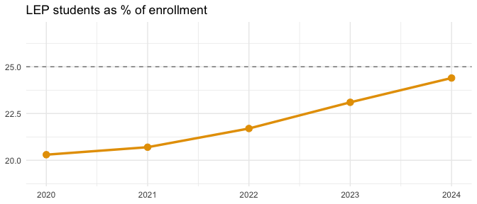

# txschooldata

Fetch and analyze Texas school enrollment data from
[TEA](https://tea.texas.gov/) in R or Python.

**Documentation: <https://almartin82.github.io/txschooldata/>**

## Installation

``` r
# install.packages("remotes")
remotes::install_github("almartin82/txschooldata")
```

## Quick Start

### R

``` r
library(txschooldata)
library(dplyr)

# Fetch 2024 data (2023-24 school year)
enr <- fetch_enr(2024)

# Statewide total
enr |>
  filter(is_state, subgroup == "total_enrollment", grade_level == "TOTAL") |>
  select(n_students)
#> 5,517,464 students
```

### Python

``` python
import pytxschooldata as tx

# Fetch 2024 data (2023-24 school year)
enr = tx.fetch_enr(2024)

# Statewide total
total = enr[(enr['is_state'] == True) &
            (enr['subgroup'] == 'total_enrollment') &
            (enr['grade_level'] == 'TOTAL')]['n_students'].sum()
print(f"{total:,} students")
#> 5,517,464 students

# Get multiple years
enr_multi = tx.fetch_enr_multi([2020, 2021, 2022, 2023, 2024])

# Check available years
years = tx.get_available_years()
print(f"Data available: {years['min_year']}-{years['max_year']}")
#> Data available: 1997-2025
```

## What can you find with txschooldata?

Texas public schools enroll **5.5 million students** across 1,200+
districts. One function call pulls it all into R:

``` r
library(txschooldata)
library(dplyr)
library(tidyr)
library(ggplot2)
library(scales)

# Grab 5 years of enrollment data
enr <- fetch_enr_multi(2020:2024)
```

Here are ten narratives hiding in the numbers.

------------------------------------------------------------------------

### 1. COVID erased a decade of growth in one year

``` r
enr |>
  filter(is_state, subgroup == "total_enrollment", grade_level == "TOTAL") |>
  select(end_year, n_students) |>
  mutate(change = n_students - lag(n_students))
#>   end_year n_students  change
#> 1     2020    5479173      NA
#> 2     2021    5359040 -120133
#> 3     2022    5402928   43888
#> 4     2023    5504150  101222
#> 5     2024    5517464   13314
```

**-120,133 students** vanished between 2020 and 2021—equivalent to the
entire enrollment of El Paso ISD.

------------------------------------------------------------------------

### 2. One in four students is now an English learner

``` r
lep <- enr |>
  filter(is_state, subgroup == "lep", grade_level == "TOTAL") |>
  select(end_year, n_students, pct) |>
  mutate(pct = round(pct * 100, 1))

lep
#>   end_year n_students  pct
#> 1     2020    1112674 20.3
#> 2     2021    1108207 20.7
#> 3     2022    1171661 21.7
#> 4     2023    1269408 23.1
#> 5     2024    1344804 24.4
```

``` r
ggplot(lep, aes(end_year, pct)) +
  geom_line(linewidth = 1.2, color = "#E69F00") +
  geom_point(size = 3, color = "#E69F00") +
  geom_hline(yintercept = 25, linetype = "dashed", color = "gray50") +
  scale_y_continuous(limits = c(19, 27)) +
  labs(title = "LEP students as % of enrollment", x = NULL, y = NULL) +
  theme_minimal()
```



From 20.3% to **24.4%** in five years. Schools need more ESL teachers
than ever.

------------------------------------------------------------------------

### 3. Coppell ISD is Texas’s first Asian-majority district

``` r
enr |>
  filter(is_district, subgroup == "asian", grade_level == "TOTAL", end_year == 2024) |>
  inner_join(
    enr |> filter(is_district, subgroup == "total_enrollment",
                  grade_level == "TOTAL", end_year == 2024) |>
      select(district_id, total = n_students),
    by = "district_id"
  ) |>
  filter(total >= 10000) |>
  arrange(desc(pct)) |>
  mutate(pct = round(pct * 100, 1)) |>
  select(district_name, total, pct) |>
  head(8)
#>    district_name total  pct
#> 1    COPPELL ISD 13394 56.7
#> 2     FRISCO ISD 66551 42.6
#> 3    PROSPER ISD 28394 29.3
#> 4      ALLEN ISD 21319 29.1
#> 5  FORT BEND ISD 80034 27.6
#> 6      PLANO ISD 47753 23.5
#> 7 ROUND ROCK ISD 46042 22.0
#> 8       KATY ISD 94589 17.2
```

**56.7% Asian**. Frisco ISD jumped from 33.6% to 42.6% in just three
years.

------------------------------------------------------------------------

### 4. Fort Worth ISD lost 14% of its students

``` r
d2020 <- enr |>
  filter(is_district, subgroup == "total_enrollment",
         grade_level == "TOTAL", end_year == 2020) |>
  select(district_id, n_2020 = n_students)

d2024 <- enr |>
  filter(is_district, subgroup == "total_enrollment",
         grade_level == "TOTAL", end_year == 2024) |>
  select(district_id, district_name, n_2024 = n_students)

d2020 |>
  inner_join(d2024, by = "district_id") |>
  mutate(change = n_2024 - n_2020, pct = round(change / n_2020 * 100, 1)) |>
  filter(n_2020 >= 10000) |>
  arrange(pct) |>
  select(district_name, n_2020, n_2024, change, pct) |>
  head(8)
#>     district_name n_2020 n_2024 change   pct
#> 1  FORT WORTH ISD  82704  70903 -11801 -14.3
#> 2      ALDINE ISD  67130  57737  -9393 -14.0
#> 3 BROWNSVILLE ISD  42989  37032  -5957 -13.9
#> 4  HARLANDALE ISD  13654  11781  -1873 -13.7
#> 5      YSLETA ISD  40404  34875  -5529 -13.7
#> 6      LAREDO ISD  23665  20557  -3108 -13.1
#> 7       ALIEF ISD  45281  39451  -5830 -12.9
#> 8     HOUSTON ISD 209309 183603 -25706 -12.3
```

Urban districts are bleeding students to suburbs and charters.

------------------------------------------------------------------------

### 5. IDEA Public Schools grew 24% in three years

``` r
enr |>
  filter(district_name == "IDEA PUBLIC SCHOOLS", is_district,
         subgroup == "total_enrollment", grade_level == "TOTAL") |>
  select(end_year, n_students)
#>   end_year n_students
#> 1     2021      62158
#> 2     2022      67988
#> 3     2023      74217
#> 4     2024      76819
```

From 62,158 to **76,819 students**. Charter networks are reshaping Texas
education.

------------------------------------------------------------------------

### 6. Fort Bend ISD has no racial majority

``` r
enr |>
  filter(district_name == "FORT BEND ISD", is_district, grade_level == "TOTAL",
         subgroup %in% c("white", "black", "hispanic", "asian"), end_year == 2024) |>
  mutate(pct = round(pct * 100, 1)) |>
  select(subgroup, pct) |>
  arrange(desc(pct))
#>   subgroup  pct
#> 1    black 27.8
#> 2    asian 27.6
#> 3 hispanic 26.7
#> 4    white 13.2
```

No group exceeds 28%. One of the most diverse large districts in
America.

------------------------------------------------------------------------

### 7. Kindergarten enrollment dropped 5.8%

``` r
enr |>
  filter(is_state, subgroup == "total_enrollment",
         grade_level %in% c("PK", "K", "01", "09", "12")) |>
  select(end_year, grade_level, n_students) |>
  pivot_wider(names_from = end_year, values_from = n_students) |>
  mutate(change = `2024` - `2020`, pct = round(change / `2020` * 100, 1))
#> # A tibble: 5 × 8
#>   grade_level `2020` `2021` `2022` `2023` `2024` change   pct
#>   <chr>        <dbl>  <dbl>  <dbl>  <dbl>  <dbl>  <dbl> <dbl>
#> 1 PK          248413 196560 222767 243493 247979   -434  -0.2
#> 2 K           383585 360865 370054 367180 361329 -22256  -5.8
#> 3 01          391175 380973 384494 399048 385096  -6079  -1.6
#> 4 09          448929 436396 475437 477875 472595  23666   5.3
#> 5 12          352258 362888 360056 364317 365788  13530   3.8
```

**-22,256 kindergartners** since 2020. The pipeline is narrowing.

------------------------------------------------------------------------

### 8. 62% of students are economically disadvantaged

``` r
econ <- enr |>
  filter(is_state, subgroup == "econ_disadv", grade_level == "TOTAL") |>
  mutate(pct = round(pct * 100, 1)) |>
  select(end_year, n_students, pct)

econ
#>   end_year n_students  pct
#> 1     2020    3303974 60.3
#> 2     2021    3229178 60.3
#> 3     2022    3278452 60.7
#> 4     2023    3415987 62.1
#> 5     2024    3434955 62.3
```

``` r
ggplot(econ, aes(end_year, pct)) +
  geom_col(fill = "#56B4E9", width = 0.6) +
  geom_text(aes(label = paste0(pct, "%")), vjust = -0.3, size = 3.5) +
  scale_y_continuous(limits = c(0, 70)) +
  labs(title = "Economically disadvantaged students (%)", x = NULL, y = NULL) +
  theme_minimal()
```


Up from 60.3%. Nearly two-thirds of Texas students qualify.

------------------------------------------------------------------------

### 9. White students dropped below 25%

``` r
enr |>
  filter(is_state, grade_level == "TOTAL",
         subgroup %in% c("white", "hispanic", "black", "asian")) |>
  mutate(pct = round(pct * 100, 1)) |>
  select(end_year, subgroup, pct) |>
  pivot_wider(names_from = subgroup, values_from = pct)
#> # A tibble: 5 × 5
#>   end_year white black hispanic asian
#>      <dbl> <dbl> <dbl>    <dbl> <dbl>
#> 1     2020  27    12.6     52.8   4.6
#> 2     2021  26.5  12.7     52.9   4.7
#> 3     2022  26.3  12.8     52.8   4.8
#> 4     2023  25.6  12.8     53     5.1
#> 5     2024  25    12.8     53.2   5.4
```

``` r
enr |>
  filter(is_state, grade_level == "TOTAL",
         subgroup %in% c("white", "hispanic", "black", "asian")) |>
  mutate(pct = pct * 100) |>
  ggplot(aes(end_year, pct, color = subgroup)) +
  geom_line(linewidth = 1.2) +
  geom_point(size = 2) +
  scale_color_manual(
    values = c("hispanic" = "#0072B2", "white" = "#E69F00",
               "black" = "#009E73", "asian" = "#CC79A7"),
    labels = c("Asian", "Black", "Hispanic", "White")
  ) +
  labs(title = "Demographics over time", x = NULL, y = "Percent", color = NULL) +
  theme_minimal() +
  theme(legend.position = "bottom")
```


Hispanic students are now **53.2%** of enrollment.

------------------------------------------------------------------------

### 10. 439 districts now have Hispanic majorities

``` r
enr |>
  filter(is_district, subgroup == "hispanic", grade_level == "TOTAL") |>
  group_by(end_year) |>
  summarize(
    total_districts = n(),
    hispanic_majority = sum(pct > 0.5),
    pct_majority = round(hispanic_majority / total_districts * 100, 1)
  )
#> # A tibble: 5 × 4
#>   end_year total_districts hispanic_majority pct_majority
#>      <dbl>           <int>             <int>        <dbl>
#> 1     2020            1202               419         34.9
#> 2     2021            1204               428         35.5
#> 3     2022            1207               433         35.9
#> 4     2023            1209               438         36.2
#> 5     2024            1207               439         36.4
```

Up from 419 in 2020. Now **36%** of all Texas school districts.

------------------------------------------------------------------------

## Learn more

- **[Full analysis with more
  charts](https://almartin82.github.io/txschooldata/articles/district-hooks.html)**
- **[Getting started
  guide](https://almartin82.github.io/txschooldata/articles/quickstart.html)**
- **[Function
  reference](https://almartin82.github.io/txschooldata/reference/)**

## Data availability

This package pulls from three TEA reporting systems:

| System       | Years     | Notes                                |
|--------------|-----------|--------------------------------------|
| **AEIS CGI** | 1997-2002 | Older AEIS format via CGI endpoint   |
| **AEIS SAS** | 2003-2012 | Academic Excellence Indicator System |
| **TAPR**     | 2013-2025 | Texas Academic Performance Reports   |

All data is fetched directly from TEA servers—no manual downloads
required.

### What’s included

- **Levels:** State, district (~1,200), and campus (~9,000)
- **Demographics:** White, Black, Hispanic, Asian, American Indian,
  Pacific Islander, Two or More Races
- **Special populations:** Economically disadvantaged, LEP/English
  learners, Special education, At-risk, Gifted
- **Grade levels:** Early Education (EE) through Grade 12, plus totals

### Formatting notes

- **IDs:** District IDs are 6 digits (e.g., `101912` for Austin ISD).
  Campus IDs are 9 digits (district + 3-digit campus number).
- **Tidy format:** By default,
  [`fetch_enr()`](https://almartin82.github.io/txschooldata/reference/fetch_enr.md)
  returns long/tidy data with `subgroup`, `grade_level`, and
  `n_students` columns. Use `tidy = FALSE` for wide format.
- **Percentages:** The `pct` column is a proportion (0-1), not a
  percentage. Multiply by 100 for display.
- **Caching:** Data is cached locally after first download. Use
  `use_cache = FALSE` to force refresh.

### Caveats

- **Asian/Pacific Islander:** Pre-2011 data combines Asian and Pacific
  Islander into a single “asian” category. Separate Pacific Islander
  data only available from 2011 onward (federal reporting change).
- **Two or More Races:** Only available from 2011 onward (federal
  reporting change)
- **Column names:** Standardized across years, but underlying TEA
  variable names differ between systems
- **Historical comparisons:** Definition of “economically disadvantaged”
  and other categories may shift over time

## Part of the State Schooldata Project

A simple, consistent interface for accessing state-published school data
in Python and R.

**All 50 state packages:**
[github.com/almartin82](https://github.com/almartin82?tab=repositories&q=schooldata)

## License

MIT
